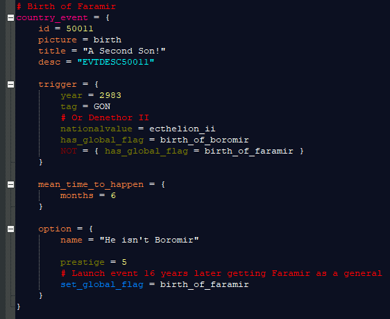

# A "Quick" File for Modders

## Why?
 - As with any project that multiple people are working on, it is likely that each person has their own beliefs for how things should be done. This document is meant to solve those disagreements.
 - This can cause many unindended issues (especially localization issues), which comes from duplicated event ids, decision names and localisations.
 - Additionally, many Vic II mods end up with file systems looking like the following image; hundreds of files, many with just a couple of lines of code. This is rather poor organization and can actually make modding harder!\
	\
	Not to pick on GFM, but it's the only other mod I have installed and the file structure is rather poorly organized. This is a combination of merging in many mods, many modders working on the mod and the lack of set rules to keep this from happening. This is just my estimation, but if one were to run the application that notifies the user of duplicated localisations, I would guess about 10% of their localisation lines would be duplicates.
 - Finally, these rules ensure that the code is standardized and readable, ensuring that debugging is done as quickly as possible.
	
## The Rules
They can essentially be boiled down to the following:
1. Follow the existing patterns for things.
2. If there is a file on the Google Drive folder that things are autogenerated from, update that file. The Drive folder is linked in the pins of the developement-modder channel in the Discord server.
3. Finally, test what you have added!

\* If using Notepad++, I would use the [provided TTA specific Victoria II language](Victoria%20II.xml). Install it by downloading the file, and dropping it in the userDefineLangs folder. You can quickly navigate to this by opening Notepad++, the clicking Language --> User Defined Language --> Open User Defined Language Folder. I will do my best to update the file as I update my copy. This can then be applied to any file by click Language --> Victoria II. It is made specifically for the Black Board theme (Settigns --> Style Configurator --> Select theme --> Black Board). It should be at the bottom of the list. Unfortunately, as there is no set unique file ending used by the engine (it just uses already existing ones, such as .txt and .csv), this has to be done to every file, every time it is opened.

\*\* These rules most likely won't change, especially once flavor becomes the major focus. That would be very counterproductive. However, more sections may be added as needed.

### Decisions
1. What file should a decision go in?
   - The short, but not really helpful, answer, it depends on what the decision is for.
   - The longer, more helpful and descriptive answer:
     - If it's for a specific nation or culture group, look at the \_\_Realms file in the Google Drive, in the "Decision File" column. Generally speaking, there is a file specific to each nation, or, if the nation does not have many decisions, they are in the largest realm in the culture group. e.g. the flavor for Lossarnach is in the `Gondor.txt` file.
     - If the decision is unlocked by something else, such as Dol Amroth's rebellion if Gondor chooses to annex Tolfalas, then it should go in the file where the first decision came from. In the provided example, the decision for Dol Amroth's rebellion should be placed right after the "The Tolfalas Question" decision in `Gondor.txt`.
     - If the decision isn't really associated with any country, but rather, a large chain, great powers, or something along those lines, put it in the provided file. For instance, a these could be something such as `War of the Ring.txt`, `Military Leader Recruitment.txt` or `Great Powers.txt`. Each of these file names give the idea of what decisions they have: `War of the Ring.txt` would hold the decisions directly related to the War of the Ring, `Military Leader Recruitment.txt`, the decisions related to the standard leader recruitment, and `Great Powers.txt`, decisions that any Great Power can do.
	
2. So I know what file to use, but where in the file should it go?
   - At the top of the file, there should be a short breakdown of what's in the file:\
     \
     The first line is just another reminder of what file you are in. The following lines are what is of interest. Each line after that first line is a section within the file. If your decision fits within one of the already defined sections, add it to that section (preferably at the bottom of the section). Otherwise, create a new section, and remember to put it in the list of sections at the top of the file (and move the closing bracket in the block comment).
	
3. What are these decision sections?\
   
   - All they are are `political_decision` blocks within the file. Because of how the engine parses decision files, it is completely fine looking at multiple `political_decision` blocks within the same file, allowing for greater organization to be done in the decision files. Above each block is a comment with a name either matching or closely matching a name in the top of the decision file. Additionally, they are in *the same order* as stated at the top of the file. 
  
4. What syntax should be used when making decisions?\
   
   - Have the opening bracket on the same line as the "=".
   - After an opening bracket, tab over one more time than the previous line.
   - Have the closing bracket start on the same tab level as the line with the corresponding opening bracket.
   - The exception is in cases like the second line of the `potential`. There is only one thing in both the `16` and `NOT` scopes. As such, it is fine to have all of that in one line. Notice how in the effect, despite the `16` scope truly only have one thing in it, since there are two thing within the `add_province_modifier` scope, nothing is collpased down into one line.
   - If something is missing and you are unable to add it in (for whatever reason), put that in a comment.

5. Anything else that should be done before committing the decision?
   - Test it! Ensure that it's working as intended.
   - Go to the flavor folder in the Google Drive folder and add it to the flavor chains if it is not there anymore, and color code it in the following way: green if the decision is done, yellow if it is missing things, yet still functional, red if there are still issues.
   - See the *Localisation* section.

### Events
1. What file should an event go in?
   - Much like decisions, it depends on what the decision is for:
     - If it's for a specific nation or culture group, look at the \_\_Realms file in the Google Drive, in the "Event File" column. Generally speaking, there is a file specific to each nation, or, if the nation does not have many events, they are in the largest realm in the culture group. e.g. the flavor for Lossarnach is in the `Gondor.txt` file.
	 - If the event is triggered by something else, such as the events Gondor gets for Dol Amroth's response to Gondor's annexation of Amrothian land, then it should go in the file where the triggering event came from. In the provided example, the events that Gondor gets for Dol Amroth's response should be placed right after the "Dol Amroth gets Annexed?" event in `Gondor.txt`.
     - If the event isn't really associated with any country, but rather, a large chain, great powers, or something along those lines, put it in the provided file. For instance, a these could be something such as `War of the Ring.txt`, `Military Leader Recruitment.txt` or `Great Powers.txt`. Each of these file names give the idea of what events they have: `War of the Ring.txt` would hold the events directly related to the War of the Ring, `Military Leader Recruitment.txt`, the events related to the standard leader recruitment, and `Great Powers.txt`, events that any Great Power can do.
	 
2. What is the file structure?
   - Like decisions, there is a short description top section of the file:\
     
	 - The first line is another reminder of what file you are in. The second line is the event ids that are reserved for this file. It is likely that there are some ids in that range that are not used.\
	 
	 - Generally, the events are in order of their ids. The exception is where an event directly related to another event (such as getting called by the second event) is added. For instance, if there were to be an event called by `Dol Amroth Refuses Annexation` (id 50006), the new event (id 50012), it would be placed after `Dol Amroth Refuses Annexation`, rather than after `Birth of Faramir`. Prior to the definition of each event, there is a comment with the title or the general idea of the event. 
	 
3. What syntax should be used when making events?\
   
   - The same rules as used when making decisions (see point 5 in the `Decisions` section).
   
4. Anything else that should be done before committing the event?
   - Test it! Ensure that it's working as intended.
   - Go to the flavor folder in the Google Drive folder and add it to the flavor chains if it is not there anymore, and color code it in the following way: green if the decision is done, yellow if it is missing things, yet still functional, red if there are still issues.
   - See the *Localisation* section.

### Modifiers
1. What is up with all of these comments having an obnoxious amount of `#`'s?\
   
   - There are two types: the three-line category headers. There are only two: `Vanilla Modifiers` and `TTA Modifiers`. They just let one know if the modifier comes from vanilla or if it was added by TTA. The other is the section headers, such as `##### RGO MODIFIERS #####`. This section defines the general idea of the modifiers in the section. In the `RGO MODIFIERS` section, I would expect general modifiers that only affect rgos be placed in there. However, if a modifier was meant for one nation, such as Gondor, it would be in the `##### GONDOR #####` section.
   
2. What syntax should be used?
   - Have the opening bracket on the same line as the "=".
   - After an opening bracket, tab over one more time than the previous line.
   - Have the closing bracket start on the same tab level as the line with the corresponding opening bracket.
   - When creating a new section, follow the `##### SECTION NAME ##### {` pattern. Also ensure that the section ends with `# }` to allow easy folding of the sections.
   
3. Anything else that should be done before committing the decision?
   - Test it! Ensure that it's working as intended.
   - See the *Localisation* section.

### Localisation
1. Why are there an obnoxious amount of comments again?\
   
   - Each of these groups of three lines tells of a new section in that localisation file. For example, in the above image, the Country Information Events localisation is collapsed, line 1023 is the Military Leader event text, and all the lines after 1026 are for Gondor events. 
   
2. Is there any order to the localisation?
   - Generally speaking, yes. The event localisation file is ordered by the files, then the ids used in that file. Pretty much all other localisation files are in the order that the things, whether the be modifiers, decisions, or something else, show up. The exception are the two "Vanilla Text" files, which are an almagamation of all of the localisation from vanilla that has not yet been changed.
   
3. What file should I put the localisation?
   - Generally speaking, all of the localisation files state exactly what they are to be used for. `Events.csv` is meant for event localisation, `Decisions.csv` for decisions, etc. 

### History Files
1. Why is there a section on History Files? Isn't that pretty straight forward?
   - Yeah. It is. However, when editing something in the province history files (or the names of provinces), the corresponding entry in the `Provinces` file in the Google Drive Folder should be updated. I autogenerate the province history files from that Drive file. If that file is not updated, the next time that the files are autogenerated, your changes will be lost!
